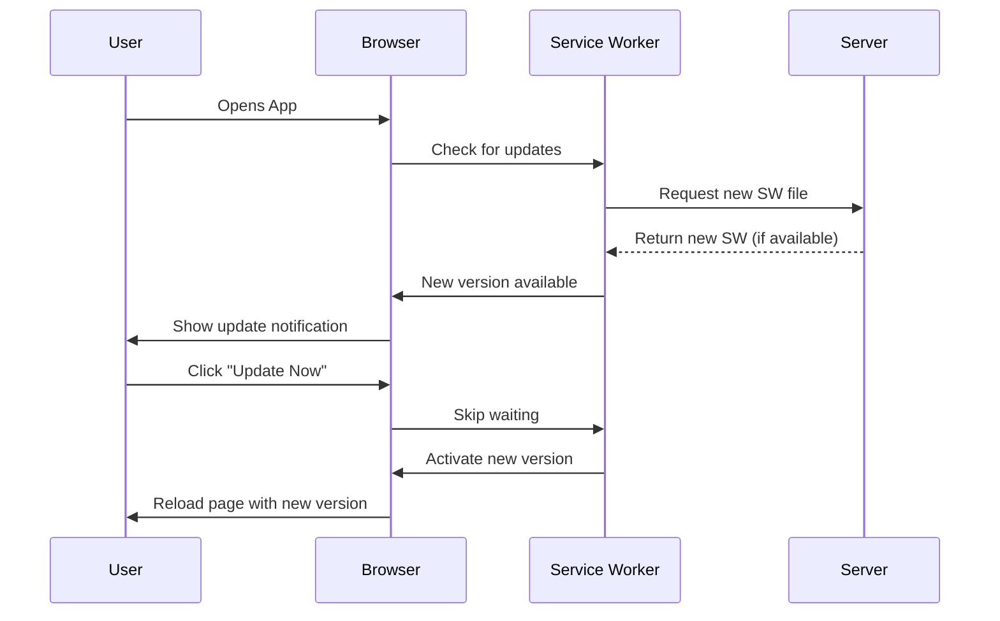

# PWA Update & Versioning Guide

## Overview

This application now includes an advanced PWA (Progressive Web App) update system that ensures all users automatically receive the latest version when you deploy updates. The system uses **Workbox** for intelligent caching and provides a beautiful update notification to users.

## How It Works

### 1. Version Management

**Version Location**: `src/service-worker.js`

```javascript
const APP_VERSION = '1.0.0';  // Update this with each deployment
const CACHE_VERSION = 'v1';    // Increment for cache-breaking changes
```

### 2. Automatic Update Flow



### 3. Update Checking

The app checks for updates:
- **On initial load**
- **Every hour** (automatically in background)
- **When user navigates** (for single-page navigation)

## Deploying New Versions

### Step 1: Update Version Number

Edit `src/service-worker.js`:

```javascript
// Old
const APP_VERSION = '1.0.0';

// New - increment version
const APP_VERSION = '1.0.1';
```

**Version incrementing rules:**
- **Patch (1.0.X)**: Bug fixes, minor changes
- **Minor (1.X.0)**: New features, backward compatible
- **Major (X.0.0)**: Breaking changes

### Step 2: Update package.json

```bash
npm version patch  # For patch updates (1.0.0 → 1.0.1)
npm version minor  # For minor updates (1.0.0 → 1.1.0)
npm version major  # For major updates (1.0.0 → 2.0.0)
```

Or manually edit `package.json`:

```json
{
  "version": "1.0.1"
}
```

### Step 3: Build and Deploy

```bash
# Build the app (generates optimized service worker)
npm run build

# Deploy to GitHub Pages
npm run deploy
```

### Step 4: Verify Update

1. Open your deployed app
2. Open DevTools → Application → Service Workers
3. Check for "Update on reload" or manually update
4. Verify new version is active

## Cache Strategies

The app uses different caching strategies for different resource types:

### Images
- **Strategy**: Cache First
- **Max Entries**: 60
- **Max Age**: 30 days
- **Rationale**: Images rarely change, prioritize speed

### JSON Data (Menu Items)
- **Strategy**: Network First
- **Max Entries**: 50
- **Max Age**: 7 days
- **Rationale**: Content updates should be fetched when available

### CSS & JavaScript
- **Strategy**: Stale While Revalidate
- **Max Entries**: 100
- **Max Age**: 30 days
- **Rationale**: Show cached version immediately, update in background

### Fonts
- **Strategy**: Cache First
- **Max Entries**: 30
- **Max Age**: 365 days
- **Rationale**: Fonts never change, cache aggressively

## User Update Experience

### Update Notification UI

When an update is available, users see:

```
┌─────────────────────────────────────────┐
│           🔄 (rotating icon)            │
│                                         │
│        New Version Available!           │
│                                         │
│  A new version of the app is ready.    │
│  Update now for the latest features    │
│  and improvements.                      │
│                                         │
│  [Update Now]  [Later]                  │
└─────────────────────────────────────────┘
```

- **Update Now**: Activates new version immediately (reloads page)
- **Later**: Dismisses notification, reminds again in 1 hour

## Cache Version Management

### When to Increment CACHE_VERSION

Increment `CACHE_VERSION` when:
- Changing cache strategies
- Major data structure changes
- Need to force clear old caches

```javascript
// src/service-worker.js
const CACHE_VERSION = 'v2';  // Was 'v1'
```

This automatically clears all caches with old version prefixes.

## Testing Updates

### Local Testing

1. **Build production version**:
   ```bash
   npm run build
   ```

2. **Serve build locally**:
   ```bash
   npx serve -s build -p 3000
   ```

3. **Test update flow**:
   - Open http://localhost:3000
   - Make a change and rebuild
   - Refresh to see update notification

### Debugging Service Workers

Chrome DevTools → Application → Service Workers:

- **Update on reload**: Forces update check on every page reload
- **Bypass for network**: Disables service worker
- **Unregister**: Removes service worker (use for clean testing)
- **Skip waiting**: Force activate waiting service worker

## Troubleshooting

### Users Not Getting Updates

**Problem**: Some users still see old version

**Solutions**:
1. Verify service worker is registered (check DevTools)
2. Ensure `APP_VERSION` was incremented
3. Check browser cache (hard refresh: Ctrl+Shift+R)
4. Verify service worker file changed on server

### Update Notification Not Showing

**Problem**: No notification appears despite new version

**Check**:
1. Service worker properly registered in `index.js`
2. `UpdateNotification` component mounted in `App.jsx`
3. Browser console for errors
4. Workbox instance passed to component

### Caching Issues

**Problem**: Old resources still loading

**Solutions**:
1. Increment `CACHE_VERSION` in `service-worker.js`
2. Clear caches manually in DevTools
3. Unregister and re-register service worker
4. Check cache expiration settings

## Best Practices

### 1. Version Every Deploy

Always update `APP_VERSION` when deploying changes:

```bash
# Before deploying
1. Edit src/service-worker.js → increment APP_VERSION
2. npm run build
3. npm run deploy
```

### 2. Test Locally First

Always test the build locally before deploying:

```bash
npm run build
npx serve -s build
```

### 3. Monitor Service Worker

Use browser DevTools to monitor:
- Service worker status
- Cache contents
- Network requests (bypassed vs cached)

### 4. Communicate Changes

For major updates, consider:
- Adding release notes
- Showing what's new after update
- Logging version in console

### 5. Handle Failed Updates

The system handles failed updates gracefully:
- Retries automatically
- Falls back to cached version
- Shows update notification when connection restored

## Advanced Features

### Background Sync (Optional)

Uncomment in `src/service-worker.js` to queue offline actions:

```javascript
import { BackgroundSyncPlugin } from 'workbox-background-sync';

const bgSyncPlugin = new BackgroundSyncPlugin('adminQueue', {
  maxRetentionTime: 24 * 60, // 24 hours
});
```

### Custom Update Logic

Modify `src/components/UpdateNotification.jsx` to:
- Show version numbers
- Display changelog
- Customize update prompt
- Add analytics tracking

## Monitoring & Analytics

Track update adoption:

```javascript
// In UpdateNotification.jsx
const handleUpdate = () => {
  // Track update acceptance
  if (window.gtag) {
    gtag('event', 'pwa_update', {
      from_version: oldVersion,
      to_version: newVersion
    });
  }
  
  workbox.messageSkipWaiting();
};
```

## Reference

- **Workbox Docs**: https://developers.google.com/web/tools/workbox
- **Service Workers**: https://developer.mozilla.org/en-US/docs/Web/API/Service_Worker_API
- **PWA Patterns**: https://web.dev/learn/pwa/

## Quick Reference Commands

```bash
# Update version and deploy
npm version patch && npm run build && npm run deploy

# Test locally
npm run build && npx serve -s build

# Clear all caches (for testing)
# Open DevTools → Application → Clear Storage → Clear site data
```
