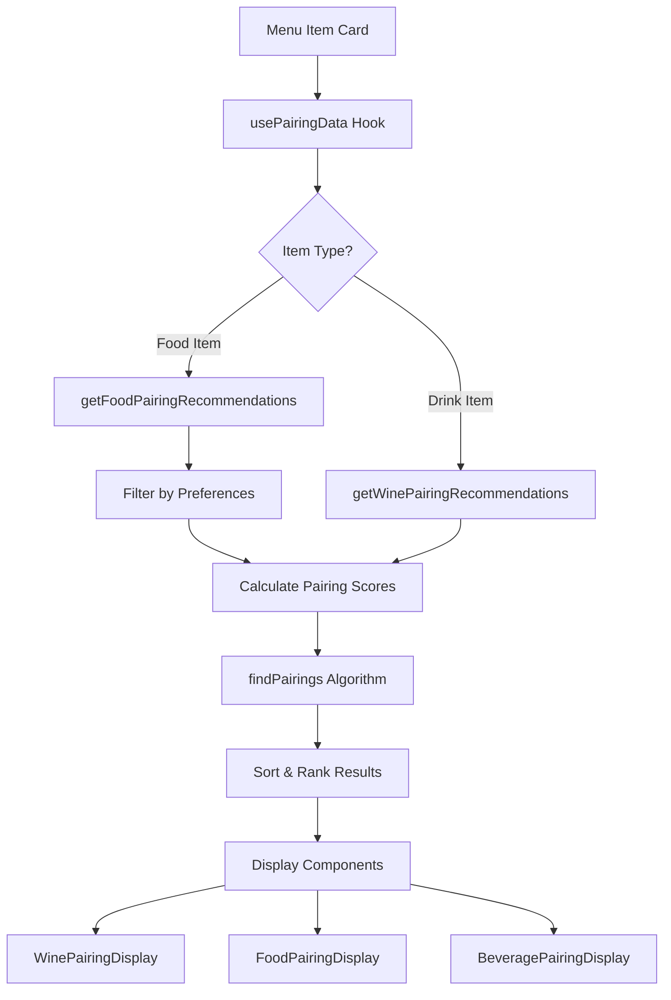
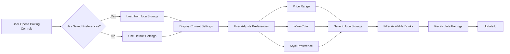
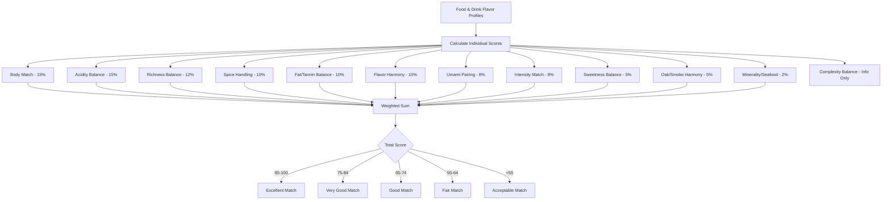
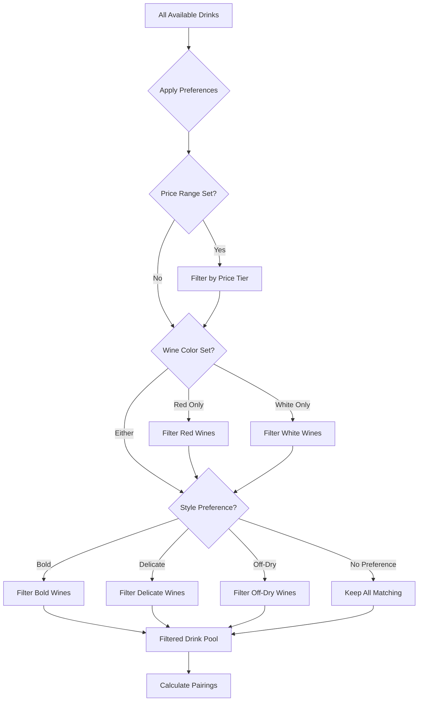
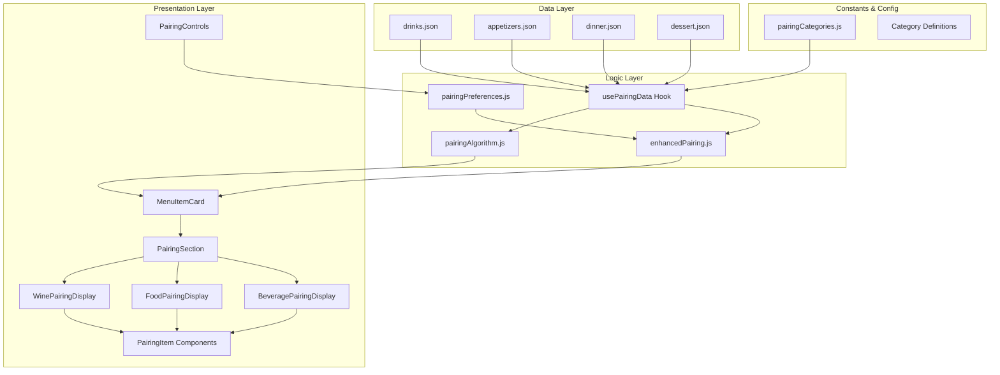

# VIA Italian Table Menu PWA (CRA Starter)

**Version 1.2.8** | [View Changelog](./CHANGELOG.md)

This is a **Create React App** starter for a VIA Italian Table interactive menu:

- Dinner, lunch, dessert, kids and drinks menus
- Proposed allergen info + dietary flags
- Wine pairing guide
- Basic admin panel (placeholder login) to edit sample dinner items
- PWA enabled (offline-capable, installable)

> This is a starter / scaffold. Data is partial and meant to be extended.

## Getting Started

1. Install dependencies:

```bash
npm install
```

2. Start the dev server:

```bash
npm start
```

The app will open at http://localhost:3000.

## Scripts

- `npm start` – run dev server
- `npm run build` – build for production
- `npm test` – run tests (none defined yet)
- `npm run eject` – CRA eject (irreversible)

## PWA / Offline & Auto-Updates

The app uses **Workbox** for advanced PWA features with automatic update notifications.

### Features

- ✅ **Offline-first caching** with intelligent cache strategies
- ✅ **Automatic update detection** - checks every hour
- ✅ **User-friendly update notifications** with one-click updates
- ✅ **Version-based cache management** - old caches auto-cleared
- ✅ **Different cache strategies** for different resource types

### Quick Start

**Deploy a new version:**

```bash
# 1. Update version in src/service-worker.js
# 2. Build and deploy
npm run build
npm run deploy
```

Users will automatically see an update notification and can update with one click!

### Implementation

- **Service Worker**: `src/service-worker.js` (Workbox configuration)
- **Registration**: `src/serviceWorkerRegistration.js` (with Workbox Window API)
- **Update UI**: `src/components/UpdateNotification.jsx`
- **Documentation**: See `PWA_UPDATE_GUIDE.md` for complete details

### Cache Strategies

| Resource Type | Strategy | Max Age | Description |
|--------------|----------|---------|-------------|
| Images | Cache First | 30 days | Fast loading, rarely change |
| JSON Data | Network First | 7 days | Fresh content when online |
| CSS/JS | Stale While Revalidate | 30 days | Instant load + background update |
| Fonts | Cache First | 365 days | Never change, cache forever |

For complete update and versioning guide, see **[PWA_UPDATE_GUIDE.md](./PWA_UPDATE_GUIDE.md)**.

## Project Structure

- `public/`
  - `index.html` – HTML shell
  - `manifest.json` – PWA manifest (app name, colors, icons)
  - `service-worker.js` – simple cache-first SW
- `src/`
  - `index.js` – entry, registers Router + SW
  - `App.jsx` – main layout + routes
  - `App.css` – main styling
  - `data/` – JSON data for menus, ingredients, wines
  - `components/`
    - `MenuPage.jsx` – renders a category page
    - `MenuItemCard.jsx` – renders a single dish
    - `FilterBar.jsx` – vegetarian / GF / nut-free / kids filters
    - `PairingsPage.jsx` – wine pairings view
    - `AdminLogin.jsx` – placeholder admin login
    - `AdminPanel.jsx` – sample admin editor for dinner items + ingredient list

## Admin Panel

Navigate to `/admin` or click **Admin** in the top nav.

- Demo password: **viaadmin**
- Once logged in you can:
  - Edit sample **dinner** items (name, description, price, flags, allergens)
  - See a read-only list of **ingredients** with attached allergens

> In this starter the admin edits are kept in React state only – they do **not** persist to disk.  
> In a real app you would hook these up to a backend / CMS to write JSON or database records.

## Data Model

All menu items are defined in JSON files under `src/data`:

Each item looks roughly like:

```json
{
  "id": "fried-calamari",
  "name": "Fried Calamari",
  "description": "Cherry peppers, lemon, marinara sauce.",
  "price": 16.99,
  "category": "Appetizers",
  "vegetarian": false,
  "glutenFree": false,
  "nutFree": true,
  "kids": false,
  "ingredients": ["calamari", "flour", "cherry-peppers", "lemon", "marinara-sauce"],
  "allergens": ["shellfish", "gluten"]
}
```

Ingredients are defined globally in `ingredients.json`:

```json
{
  "id": "flour",
  "name": "Wheat Flour",
  "allergens": ["gluten"]
}
```

Wines are defined in `wines.json` with pairing targets:

```json
{
  "id": "san-felice-chianti",
  "name": "San Felice Chianti Classico",
  "year": 2022,
  "type": "Red",
  "region": "Tuscany, Italy",
  "notes": "Bright cherry, savory herbs, food-friendly acidity.",
  "pairsWith": ["fried-calamari", "three-meatballs"]
}
```

The **Pairings** page uses `pairsWith` to show which dishes match each wine.

## Pairing System Architecture

The app features an intelligent food and drink pairing system based on flavor profiles and classic pairing principles. The system takes into account user preferences for price range and wine color/style.

### System Overview



### Pairing Preferences Flow



### Pairing Score Calculation

The algorithm calculates compatibility scores based on 12 weighted factors:



### Preference Filtering Logic



### Component Architecture



### Key Pairing Principles

1. **Body Matching**: Light-bodied foods pair with light-bodied wines, full-bodied with full-bodied
2. **Acidity Balance**: High acid foods need high acid wines to avoid tasting flat
3. **Richness Management**: Rich/fatty foods need acidity, tannin, or bubbles to cut through
4. **Spice Handling**: Spicy foods pair better with sweeter, lower-alcohol wines
5. **Umami & Tannin**: High umami foods (aged cheese, mushrooms) pair well with tannic wines
6. **Fat & Tannin**: Fatty meats require tannins to cleanse the palate
7. **Intensity Matching**: Bold flavors shouldn't overpower delicate wines and vice versa
8. **Complementary Flavors**: Matching or complementary flavor notes create harmony

## Extending

- Flesh out all menu JSON files with full VIA menus.
- Wire AdminPanel to edit **all** menu sections, ingredients and wines.
- Persist JSON updates to a backend (Node, Firebase, etc.) instead of keeping them in-memory.
- Replace placeholder icons in `public/` with real logo assets.
- Add analytics tracking for update adoption and user engagement.
- Implement background sync for offline admin actions.

## License

This is a demo scaffold. Use and modify freely for your own VIA-style menu project.
